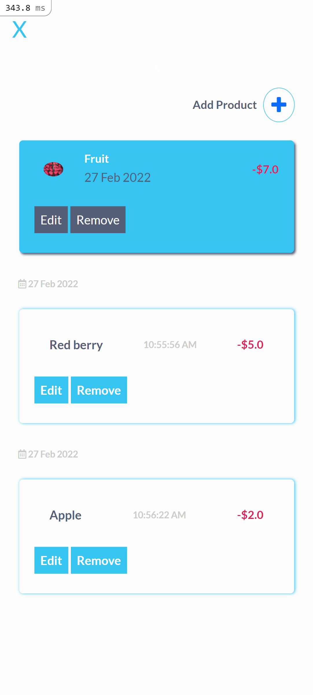

# Budget-app project

> This is a ruby on rails mobile web application where you can manage your budget: you have a list of transactions associated with a category, so that you can see how much money you spent and on what.

# Demo Link

Click [here](https://julie-budgetapp.herokuapp.com/) to view the website online.

# Video presentation Link

Click [here](https://www.loom.com/share/25d0142d8c6a4eabbafccec9af3158cb)

# Screenshots

|            Splash Screen             |              SignUp/In               | Category Page                         | Product Page                         |
| :----------------------------------: | :----------------------------------: | ------------------------------------- | ------------------------------------ |
|  |  |  |  |

# Getting Started

To get a local copy up and running follow these simple steps.

- You can clone this repo by typing `git clone https://github.com/julie-ify/Budget-app.git` on your terminal.

- Type `cd Budget-app` to access the project on the terminal.
- Run `bundle install` to install all the required dependancies.

- Run `rails s` to start a development server.

# Testing

`rspec spec` will run all the tests.

Also, you can run `rspec spec/` to run specific tests.

You can also run `RAILS_ENV=test rspec spec/` to run the tests in test mode.

## Errors

If you encounter any errors, run the following commands.

- Run `rake db:drop db:create db:migrate` to drop, create and migrate a new database.

- Run `rubocop && rubocop -A` to check for and fix code errors.

# This project was built with

- Ruby on Rails

- Postgressql

- Bootstrap CSS Framework

- Device

- Cancancan

- Capybara

- Rspec

# 👤 Author

👤 **Juliana Ifionu**

- GitHub: [juliana-Ifionu](https://github.com/julie-ify)
- LinkedIn: [Juliana Ifionu](https://www.linkedin.com/in/e-ifionu/)

# 🤝 Contributing

Contributions, issues, and feature requests are welcome!

Feel free to check the [issues page](https://github.com/julie-ify/Budget-app/issues).

# Show your support

Give a ⭐️ if you like this project!

# Acknowledgement

- Original design idea by [Gregoire Vella on Behance..](https://www.behance.net/gregoirevella)
- A big thanks to [@microverseinc](https://github.com/microverseinc).

# 📝 License

This project is [MIT](./MIT.md) licensed.
