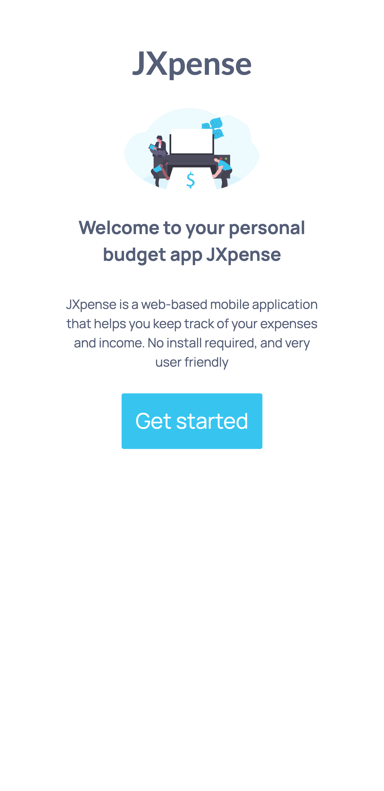
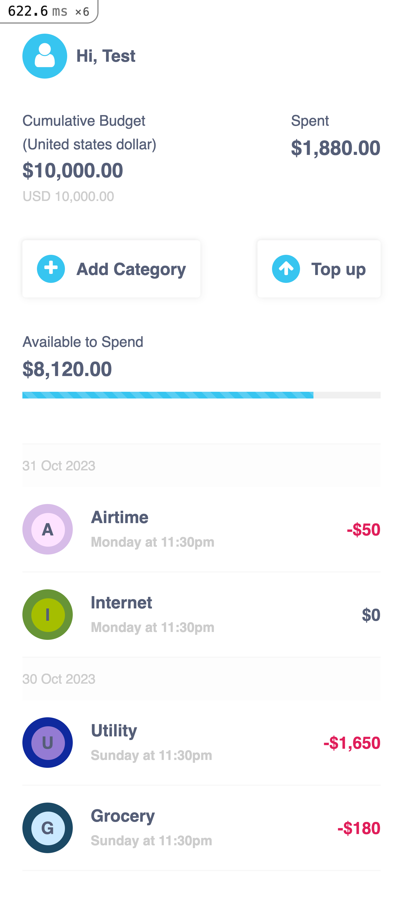
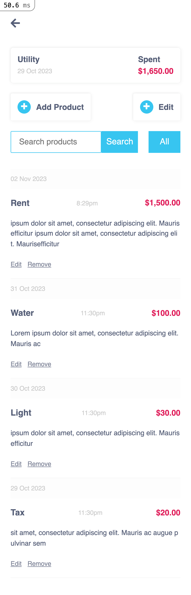

# JXpense project

> JXpense is a ruby on rails mobile web-based application that helps you keep track of your expenses and income. No install required, and very user friendly.

# Live Link

Click [here](https://jxpense.onrender.com/) to view the website online.

# Screenshots

|            Splash Screen             |              SignUp/In               | Category Page                         | Product Page                         |
| :----------------------------------: | :----------------------------------: | ------------------------------------- | ------------------------------------ |
|  |  |  |  |

# Getting Started

To get a local copy up and running follow these simple steps.

- You can clone this repo by typing `git clone git@github.com:julie-ify/JXpense.git` on your terminal.

- Type `cd JXpense` to access the project on the terminal.
- Open the project in your code editor
- Run `bundle install` to install all the required gems
- Run `rake db:setup` to setup your database
- Run `rails s` to start a development server
- Run `rubocop && rubocop -A` to check for and fix formatting errors.

# Integration/Unit Testing

`rspec spec` will run all the tests.

Also, you can run `rspec spec/` to run specific tests.

You can also run `RAILS_ENV=test rspec spec/` to run the tests in test mode.

# Manual Testing

If you would like to test the app using a test user account which has seed data

#### Login Details
- email: `testuser@gmail.com`
- password: `testuser`

# This project was built with

- Ruby on Rails

- Postgressql

- Bootstrap CSS Framework

- SCSS

- Device

- Cancancan

- Capybara

- Rspec

# 👤 Author

👤 **Juliana Ifionu**

- GitHub: [juliana-Ifionu](https://github.com/julie-ify)
- LinkedIn: [Juliana Ifionu](https://www.linkedin.com/in/julianaifionu/)

# 🤝 Contributing

Contributions, issues, and feature requests are welcome!

Feel free to check the [issues page](https://github.com/julie-ify/JXpense/issues).

# Show your support

Give a ⭐️ if you like this project!

# Acknowledgement

- Original design idea by [Gregoire Vella on Behance..](https://www.behance.net/gregoirevella)

- Improved design by me

# 📝 License

This project is [MIT](./MIT.md) licensed.
